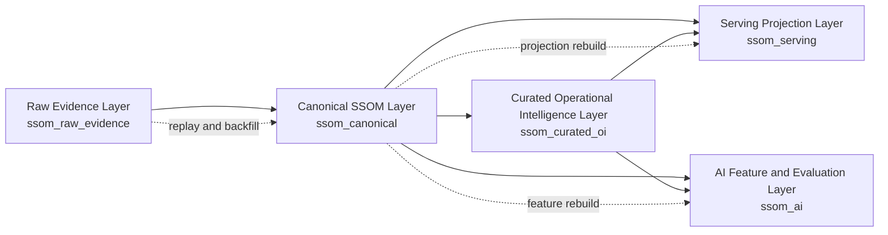

# SSOM BigQuery Reference Architecture v0.9

This document defines a cloud-scale BigQuery reference architecture for SSOM. It is a Google Cloud specific reference implementation, not the SSOM semantic standard itself.

SSOM standardizes semantic meaning. This architecture shows one credible way to store, govern, project, and analyze SSOM-aligned data in BigQuery without conflating raw evidence, canonical semantic facts, workflow projections, AI features, or application-private state.

## Scope boundary

- SSOM semantic model: defined by the RFCs, JSON Schemas, and executable conformance fixtures.
- BigQuery reference architecture: a provider-specific storage and analytics pattern for large-scale OT workloads.
- Production implementation responsibility: environment-specific IAM, quotas, SLAs, regional choices, reservation management, ingestion tooling, and operational runbooks remain implementation responsibilities.
- Cloud-provider-specific choices: dataset layout, partitioning, clustering, materialization strategy, row access policies, and reservation controls in this document are BigQuery choices, not normative SSOM requirements.

## Layered architecture

The reference architecture uses five explicit layers.

1. Raw Evidence Layer
   Immutable or append-preserving source payloads, raw telemetry, source events, original units, original quality, source schema, and ingestion metadata.
2. Canonical SSOM Layer
   Typed, normalized Asset, Identifier Assignment, Relationship, Observation, Measurement, Event, Alarm, Condition, Failure, Work, Recommendation, Decision, Action, and Outcome facts.
3. Curated Operational Intelligence Layer
   Condition projections, reliability cohorts, risk models, event correlation, maintenance effectiveness, comparative asset analysis, and governed operational metrics.
4. Serving Projection Layer
   Workflow-optimized and API-optimized projections for ServiceNow, EAM, dashboards, mobile applications, and operational-control surfaces.
5. AI Feature and Evaluation Layer
   Feature tables, retrieval views, model-input datasets, recommendation evaluation datasets, feedback loops, and outcome labels.

## Dataset naming and boundaries

Use one dataset per layer per residency domain. A practical pattern is:

- `ssom_raw_evidence`
- `ssom_canonical`
- `ssom_curated_oi`
- `ssom_serving`
- `ssom_ai`

For stronger regional separation, suffix the dataset by residency or deployment domain, for example:

- `ssom_raw_evidence_us`
- `ssom_canonical_us`
- `ssom_serving_eu`

Do not collapse all layers into a single dataset. Dataset boundaries are part of governance, cost attribution, access control, and rebuild discipline.

## Dataset and layer diagram

## Isolation model

Use typed isolation columns in every fact or projection table:

- `tenant_id`
- `organization_id`
- `site_id`
- `region_code`

Recommended patterns:

- Separate projects for strongly isolated environments such as regulated tenants, sovereign workloads, or hard billing boundaries.
- Separate datasets for layer and residency boundaries.
- Typed tenant or site columns for row access policy enforcement and workload filtering.
- Cluster on tenant, site, asset, and workload dimensions that dominate query predicates.

Do not assume dataset names alone provide tenant isolation. Use IAM, row access policies, and where needed separate projects.

## BigQuery physical design guidance

### Event-time partitioning

- Partition raw telemetry and event tables by `DATE(event_time)`.
- Partition canonical fact tables by their dominant temporal access column, typically `DATE(event_time)` for observations or events and `DATE(recorded_at)` for slowly changing semantic facts.
- Use ingestion-time partitioning only for operational landing tables where source event time may be absent.

### Clustering

Recommended clustering order for high-volume fact tables:

- `tenant_id, site_id, canonical_asset_id, measurement_type`

Recommended clustering order for event and workflow facts:

- `tenant_id, site_id, canonical_asset_id, event_category`
- `tenant_id, site_id, canonical_asset_id, work_status`

Do not over-cluster on many low-value columns. Choose columns that consistently appear in filters or joins.

### Typed column requirements

Frequently queried fields must be typed columns, not JSON-first access paths. At minimum keep the following typed:

- canonical IDs and source event IDs
- tenant, organization, site, and region identifiers
- event time, ingest time, effective time, and processing time
- measurement type, quantity kind, original unit code, canonical unit code, and quality state
- relationship type, event category, alarm state, work status, action type, and outcome disposition
- lineage keys such as `correction_of_fact_id`, `supersedes_fact_id`, and `superseded_by_fact_id`

Use JSON only for retained source payloads, sparse source-specific fragments, or opaque evidence that is not a primary analytical access path.

### High-cardinality telemetry

- Keep raw telemetry in append-preserving raw evidence tables.
- Normalize only the fields needed for governed semantics and repeatable analytics.
- Avoid storing high-frequency telemetry in workflow tables, task tables, or generic current-state tables.
- Use derived daily or hourly curated tables for repeated analytics rather than repeatedly scanning raw telemetry.

## Table behavior rules

Document each table by mutation contract:

- Append-only: raw payloads, raw source events, canonical observations, canonical events, canonical alarms, recommendations, decisions, actions, outcomes.
- Slowly changing: asset facts, identifier assignments, relationship facts, condition projections, current-state serving tables.
- Derived and rebuildable: curated reliability cohorts, event correlation tables, dashboard tables, AI feature tables, retrieval views.

Preserve corrected and superseded evidence through new rows and lineage references. Do not destructively overwrite canonical evidence to hide earlier interpretations.

## Late-arriving data, corrections, and replay

### Late-arriving data

- Store `event_time`, `ingest_time`, and `processed_time` separately.
- Do not repartition history by ingest time alone when event-time analytics matter.
- Use canonical lineage columns and correction references for revised facts.

### Corrected and superseded facts

- Preserve `fact_version`.
- Use `correction_of_fact_id`, `supersedes_fact_id`, and `superseded_by_fact_id`.
- Mark current records with `is_current` in rebuildable current-state projections instead of mutating append-preserved fact history.

### Replay and projection rebuilds

- Rebuild canonical facts from raw evidence when mapping logic changes.
- Rebuild serving and AI layers from canonical facts rather than from raw payloads when semantics are already governed.
- Keep projection SQL idempotent and date-range scoped for operational replay.

### Backfills

- Backfill by bounded event-time windows.
- Track `backfill_run_id` and `source_snapshot_ref`.
- Materialize backfilled results into the same canonical contract tables with distinct processing metadata.

## Ingestion patterns

- Batch: historical loads, periodic CMMS extracts, equipment master refreshes, daily reliability calculations.
- Micro-batch: frequent gateway drops, hourly historian extracts, periodic alarm snapshots.
- Streaming: high-value alarm or event streams, near-real-time telemetry summaries, operator advisories.

Recommended pattern:

- Land into raw evidence first.
- Normalize into canonical fact tables using deterministic transforms.
- Derive curated, serving, and AI datasets from canonical facts.

## Expected query patterns

The reference SQL supports these dominant workload shapes:

- asset-centric condition trend by time window
- cross-site peer comparison by asset class or measurement type
- recommendation, action, and outcome effectiveness tracking
- current-state workflow serving projections
- AI retrieval context assembly by asset and recent evidence
- graph or adjacency traversal through current relationship edges

## Graph and adjacency patterns

- Store canonical relationship facts in the canonical layer.
- Publish current adjacency projections in curated or serving layers with one row per current edge.
- For multi-hop traversal, use bounded recursive logic in orchestration or derived adjacency tables instead of scanning raw JSON relationship payloads.

## Materialization guidance

- Use materialized views for heavily reused filtered aggregates with stable SQL, such as current condition rollups or recent severity counts.
- Use scheduled derived tables for expensive joins, peer cohorts, feature sets, and dashboard tables reused across many workloads.
- Prefer views for thin projections or policy-filtered access surfaces.

## Retention guidance

- Raw retention: keep according to regulatory, forensic, and replay needs. Raw evidence is usually longest-lived.
- Canonical retention: keep as the governed semantic history of record unless policy requires archival.
- Serving retention: use shorter retention or rebuild windows because serving tables are projections, not the system of record.
- AI feature retention: retain only as needed for model reproducibility, drift review, and auditability.

## Cost governance

- Partition prune every large query by event-time or recorded-at windows.
- Cluster by tenant, site, asset, and workload keys.
- Publish narrow serving and feature tables for repeated access patterns.
- Reserve raw JSON scans for audit or replay workflows.
- Apply workload management through reservations, assignment strategy, and scheduled rebuild windows.
- Separate exploratory workloads from operational serving workloads with reservations or job labels.

Do not promise infinite scalability. This architecture is designed for horizontally scalable, workload-governed industrial data operations using BigQuery leading practices.

## Data access governance

- Apply least-privilege IAM at project and dataset scope.
- Use row access policies for tenant or site isolation where shared datasets are necessary.
- Use policy tags for sensitive fields such as source payloads, operator notes, and external identifiers.
- Publish authorized views or serving datasets for product-specific consumers rather than exposing canonical fact tables broadly.
- Record job labels, data product ownership, and steward contacts for auditability.

## Multi-region and data residency

- Keep raw and canonical datasets in the region or multi-region required by source-system and policy constraints.
- Do not replicate sensitive raw payloads across regions without an explicit data residency decision.
- When global analytics are required, publish curated summaries into an approved analytics region rather than freely copying all raw evidence.

## Auditability and lineage

- Preserve source payload references in raw evidence.
- Carry source event IDs, canonical IDs, and transformation run IDs across layers.
- Keep deterministic mapping versions and transformation version identifiers.
- Record backfill and replay metadata.
- Keep current-state projections rebuildable from canonical history.

## Runtime validation status

This repository does not include a live BigQuery environment. The reference implementation is statically validated only. Static validation in this repository checks:

- the presence of all five layers;
- required datasets, tables, views, and query examples;
- typed-column and partition or clustering guidance coverage;
- migration and implementation-boundary documentation coverage.

It does not prove runtime permissions, slot behavior, ingestion throughput, storage lifecycle policy execution, or BigQuery SQL execution against a live project.

## Runnable deployment checklist

1. Create one BigQuery project or dataset group per approved environment and residency boundary.
2. Create the five reference datasets with approved locations.
3. Apply IAM, row access policies, policy tags, and reservation assignments.
4. Deploy the DDL in `reference-implementation/bigquery/schema.sql`.
5. Configure raw ingestion paths for batch, micro-batch, and streaming sources.
6. Wire deterministic normalization jobs from raw evidence to canonical SSOM tables.
7. Build curated projections, serving tables, and AI feature tables from canonical facts.
8. Run the example analytical and serving queries in `reference-implementation/bigquery/example-queries.sql` after adapting dataset names and residency settings.
9. Validate cost controls, partition pruning, and clustering effectiveness on representative workloads.
10. Document transformation versioning, replay procedures, and backfill runbooks before production use.